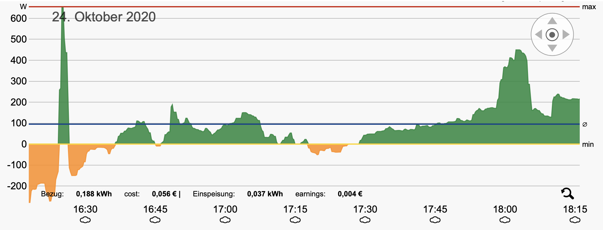

# Discovergy API client (PHP)

If you own a smart energy meter from [Discovergy](https://www.discovergy.de), this simple PHP client might a good starting point.
The [REST API provided by  Discovergy](https://api.discovergy.com/docs/) provides endpoints to 
retrieve metadata about your smart meter, but -- more interesting -- also for your energy consumption and energy production.
   
This client concentrates on the measurements (energy consumption/production), but other endpoints can easily be added.

### Why PHP?
Although Discovergy offers Java sources for demonstrating their API, I decided to provide a simple PHP script.
I favor Java over PHP in nearly all situations, however, the main purpose of using the Discovergy API 
is more likely to be on a small hardware like a Raspberry Pi Nano (or IoT device) than on a fully-fledged web server with a JVM.
Secondly, you can easily integrate the PHP script on your own low-cost website or private webserver.

# Usage
## API access
Accessing the API is (unfortunately!) only possible using your login credentials you get for the Discovergy portal.

Create a file named `credentials` next to the PHP files. 
Line one needs to contain your username, line two your password. That's it.

Warning|!
--------|--------
Having said this, make sure that none can access this file (set `chmod to 400`). You might also want to have a look into `oauth1ClientBuilder.php` and change the credential file location by altering `CREDENTIALS_FILE` value|

##  Retrieving your energy consumption / production

The script is called by running `main.php`.

    php main.php 

At the time of writing, only the first smart meter is considered: 

    $meters = $client->getMeters(); 
        
        
In order to fit the results, you need to pass the timestamps in microseconds to most API calls.

# Units

* Timestamps are interpreted by Discovergy in *micro*seconds after 1.1.1970 and time zone is UTC
* The energy consumption/production unit is given in mW (Milli Watt). So a value of 50600 means 50,6 Watts.
* The method `getReadings` has a default argument `$resolution='three_minutes'`. If you need more precise values, pass `'raw'` as argument (see the API docs for further values).
* If negative a Watt measurement means 'energy produced', otherwise it's consumed (taken from the power grid)
* By default all responses are output in JSON
    
# Example output

    $energyProduced = $client->getReadings($meterId, $fieldPower, 1603551620000, 1603552320000);

... results in ...
 
    [
      {
        "time": 1603551635519,
        "values": {
          "power": 92600
        }
      },
      {
        "time": 1603551679530,
        "values": {
          "power": 91700
        }
      },
      {
        "time": 1603551718706,
        "values": {
          "power": 109000
        }
      },
      {
        "time": 1603551803565,
        "values": {
          "power": 143600
        }
      },
      {
        "time": 1603551846699,
        "values": {
          "power": 146900
        }
      },
      {
        "time": 1603551875508,
        "values": {
          "power": 141800
        }
      },
      {
        "time": 1603551926697,
        "values": {
          "power": 140800
        }
      },
      {
        "time": 1603551958710,
        "values": {
          "power": 136200
        }
      },
      {
        "time": 1603551997897,
        "values": {
          "power": 127200
        }
      },
      {
        "time": 1603552045906,
        "values": {
          "power": 84700
        }
      },
      {
        "time": 1603552084297,
        "values": {
          "power": 55000
        }
      },
      {
        "time": 1603552129113,
        "values": {
          "power": 24800
        }
      },
      {
        "time": 1603552163510,
        "values": {
          "power": 37900
        }
      },
      {
        "time": 1603552209918,
        "values": {
          "power": 50600
        }
      },
      {
        "time": 1603552249095,
        "values": {
          "power": 13700
        }
      },
      {
        "time": 1603552285098,
        "values": {
          "power": -1400
        }
      },
      {
        "time": 1603552315495,
        "values": {
          "power": 8400
        }
      }
    ]

The values refer to the energy consumption from Oct.25 2020 at about 17:12h local time, when it was pretty cloudy ;-)